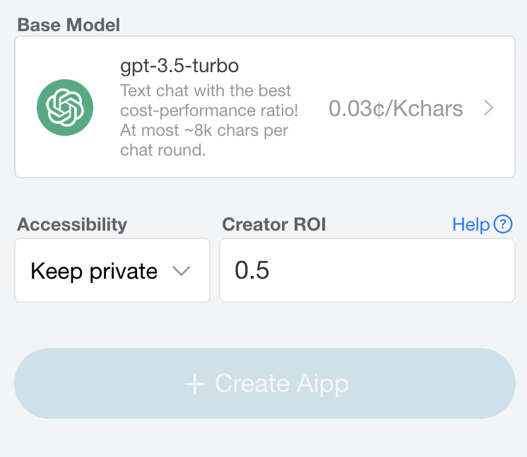

# How to earn money from your Aibot?

🌐 [简体中文](./_zhcn.md)

<!-- 🌎 to be added -->

🚀 [WebApp](https://u.babelyx.com) ｜ [Navite Apps](https://links.babelyx.com)

---

Whenever a user uses an Aibot you've created, you will receive corresponding income! For example:

- Assuming the cost of the base model is `0.3¢/KChar`.
- Assuming you set the profit margin to `0.5` (recommended to be between 0.1 and 10).
- `User price = base model cost + creator profit`. Other users will see your Aibot priced at `0.3¢/KChar + (0.3¢/KChar x 0.5) = 0.45¢/word`.
- `Creator profit = user usage * base model cost * creator profit margin`. Assuming your app is used for a total of 25,000 KChar by other users, you will earn `25,000 * 0.3¢/KChar * 0.5 = 3750¢`.

---

[**🔙 Go Home**](../../_enus.md)
