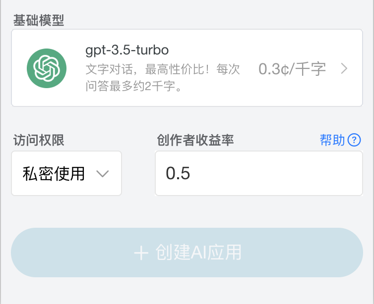

# 怎样从智能体中获得收入？

🌐 [English](./_enus.md)

<!-- 🌎 待定 -->

🚀 [网页应用](https://u.babelyx.com) ｜ [手机应用](https://links.babelyx.com)

---

每当有用户使用您创建的 AI 应用，您就会获得相应的收入！例如：

- 假设基础模型的成本价为 `0.3¢/千字`；
- 假设您设置的收益率为 `0.5` （推荐设为 0.1 至 10 倍 之间）；
- `用户价格 = 基础模型成本价 + 创作者收益`。其他用户将看到您的应用标价为 `0.3¢/千字 + (0.3¢/千字 x 0.5) = 0.45 ¢/千字`。
- `创作者收益 = 用户使用量 x 基础模型成本价 x 创作者收益率`。假设您的 Aipp 被其他用户使用了总计 25000 千字，则您将从中获得 `25000 x 0.3¢/千字 x 0.5 = 3750¢`。

---

[**🏠 返回首页**](../../_zhcn.md)
