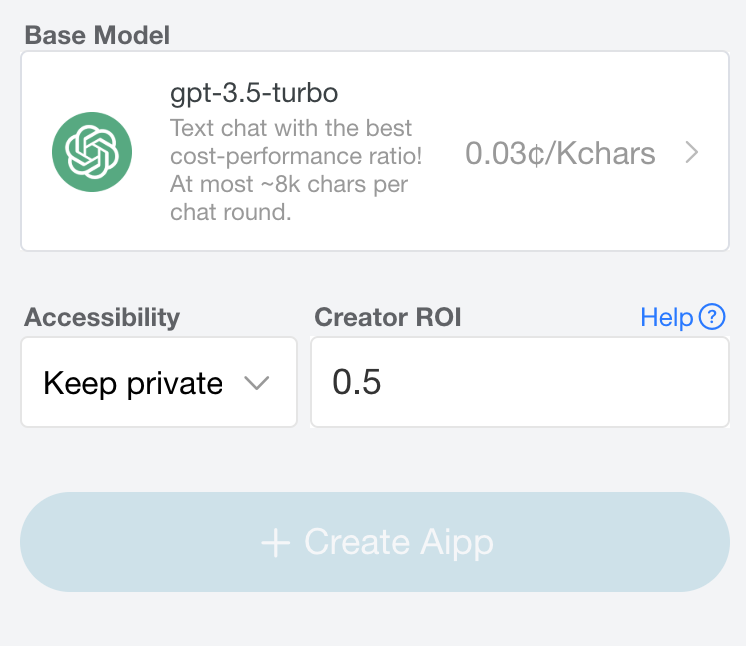

# How to earn money from your Aipp?

🌎 [简体中文](./_zhcn.md)

---

Whenever a user uses an Aipp you've created, you will receive corresponding income! For example:

- Assuming the cost of the base model is `0.3¢/KChar`.
- Assuming you set the profit margin to `0.5` (recommended to be between 0.1 and 10).
- `User price = base model cost + creator profit`. Other users will see your Aipp priced at `0.3¢/KChar + (0.3¢/KChar x 0.5) = 0.45¢/word`.
- `Creator profit = user usage * base model cost * creator profit margin`. Assuming your app is used for a total of 25,000 KChar by other users, you will earn `25,000 * 0.3¢/KChar * 0.5 = 3750¢`.

---

[**🔙 Back to Home**](../../_enus.md)
